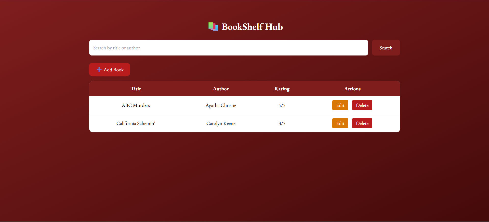

# 📚 BookShelf Hub

A Tailwind CSS styled PHP & MySQL CRUD web application.

## Features
- Add, Edit, Delete Books
- Book Ratings
- Search Functionality
- Responsive UI using Tailwind CSS
- Secure Prepared Statements

## Tech Stack
- Frontend: HTML, Tailwind CSS, JavaScript
- Backend: PHP
- Database: MySQL

## Setup
1. Create database `bookshelf`
2. Create table `books`
3. Run using XAMPP / localhost

## Screenshots
### Home Page

### Add New Book

